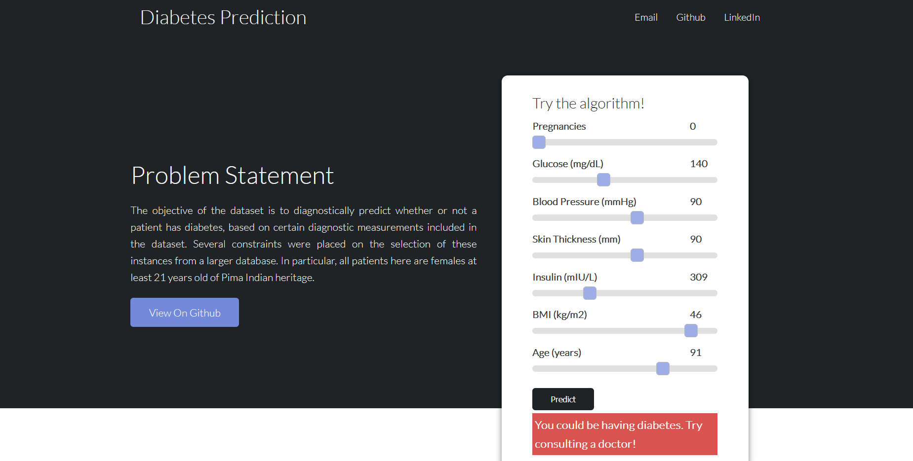
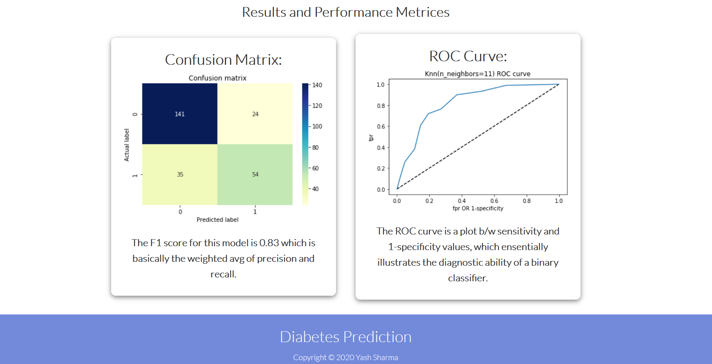
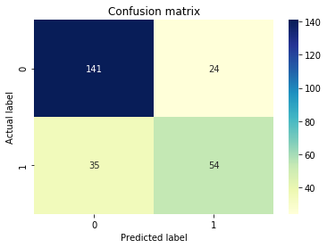
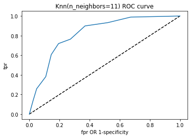

# Diabetes_Prediction

The project is based on a supervised machine learning algorithm called K nearest neighbors / KNN.

KNN is used for both classification and regression. The input consists of the k closest training examples in feature space.

Link to woring project: https://ml-prediction-diabetes.herokuapp.com/

# Problem Statement

The objective of the dataset is to diagnostically predict whether or not a patient has diabetes, based on certain diagnostic measurements included in the dataset. 
Several constraints were placed on the selection of these instances from a larger database. 
In particular, all patients here are females at least 21 years old of Pima Indian heritage.

# Tech Stack

| Target | Stack |
| ------ | ------ |
| Front end | HTML+CSS |
| Algorithm | Python |
| Server | Flask |


# Sneak Peek



# Results


The F1 score for this model is 0.83 which is basically the weighted avg of precision and recall. 



The ROC curve is a plot b/w sensitivity and 1-specificity values, which ensentially illustrates the diagnostic ability of a binary classifier. 


# Getting started
After cloning the repo you can run this command to fetch all requirements. Note that you need to have Python installed on your system.
```
pip install -r requirements.txt
```
OR use
```
docker pull yasharma2301/diabetes_predictions1.0:latest
```
